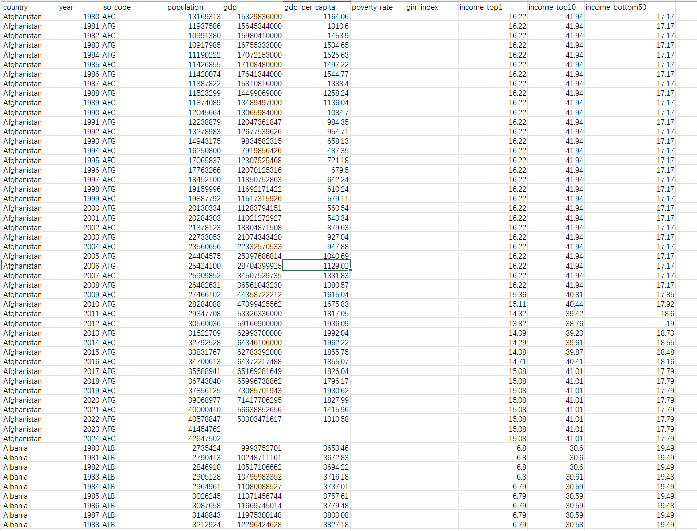

## Body

Global Economic Inequality and Poverty - 1980-2024 Real Data

This dataset provides a panel of economic indicators related to income inequality, poverty, and economic development across countries worldwide, covering the years from 1980 to 2024.

Each row represents an observation for a country-year, combining macroeconomic indicators with measures of income distribution.

Statistical Information: Country	Year	International Code	Population	GDP	Per Capita GDP	Poverty Rate	Gini Coefficient	Top 10% Income Group Revenue	Top 1% Income Group Revenue	Bottom 50% Income Group Revenue

Macroeconomic Indicators   Population, GDP, and Per Capita GDP Data Source: Primarily sourced from the World Bank's National Accounts data, providing a nationally consistent coverage (Our Data World)
Poverty and Gini Indexes: These metrics summarize data primarily from the World Bank's Household Survey database. (Our Data World)
Income Distribution Shares: The World Inequality Database (WID)

The dataset integrates data from multiple major international databases and harmonizes them into a single machine-friendly panel dataset suitable for the following uses:
--------Economic Research
--------Panel Data Analysis
--------Data Science Projects
--------Machine Learning Applications
--------Visualization and Exploratory Analysis

## Images

Here is a pay link on Stripe ( https://buy.stripe.com/3cs8yP7sY87d0vu9AB ). Please contact me lonlonago@foxmail.com after funding $89, and I will send you a complete data files , thank you!

